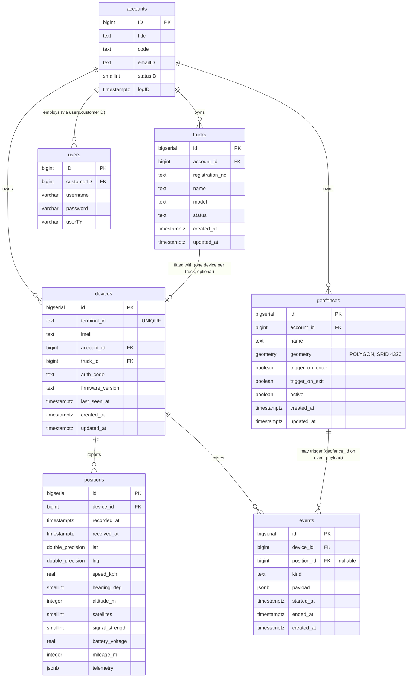

# Schema v2 — design (Stage 1)

This is the schema we are migrating to. It replaces the noisy, partially-broken telemetry tables documented in [`current-state.md`](./current-state.md) §2 and adds the trucks/geofences/proper-devices tables the platform needs to actually work end-to-end.

This document is **design only**. No migrations are written, no entity files are updated, no code changes. After review it becomes the spec that Stage 1's migrations and Stage 2's ingestion refactor implement against.

**Production state confirmed against `gps_services` on 2026-05-04:**
- 12 tables exist today: `accounts`, `allotments`, `command_reply`, `devices`, `employee`, `gps_alarms`, `gps_data`, `gps_extra_data_msg`, `gps_extra_location`, `gps_status`, `heartbeats`, `users`.
- `trucks` table does **not** exist. `accounts_dtl` does **not** exist.
- `allotments` exists but is generic (`id, typeid, reasonid, pointid, statusid, userid, logid`) — not specifically a trucks-to-customers join. Treated as legacy in this design.
- `devices` has 65–70 rows, **none** with non-null `terminalId`. The auth handler is broken; rows have no useful linkage to real trackers. Free to redesign.
- `users` has three known-dirty rows whose `customerID` does not exist in `accounts`: `ID=1` (EZELDAdmin → 1466), `ID=4` (EZ/CS/006 → 6), `ID=5` (EZ/CS/043 → 47). These are test rows; the Stage 1 migration deletes them before adding the FK. See Q5 in §"Resolved design questions" below.
- **PostGIS 3.4.2 is installed and active** in `gps_services`. No `CREATE EXTENSION` is required in our migration; the v2 schema uses the PostGIS types directly.

**Migration approach (locked, "Option B" from earlier discussion):** drop everything telemetry-side, start fresh. Keep the master-data tables (`accounts`, `users`) intact and add foreign keys pointing at them. Risks and mitigations in §"Migration strategy" at the bottom.

---

## ER diagram



PostGIS 3.4.2 is enabled in `gps_services`; `geofences.geometry` is a real `geometry(POLYGON, 4326)` column (not JSONB). The `shape` discriminator is no longer needed and has been removed.

---

## New / redesigned tables

### `positions`

**Purpose.** One row per GPS fix, written by the ingestion service every time a tracker reports a `0x0200` location packet. Replaces `gps_data`, `gps_extra_location`, and `gps_extra_data_msg` from the v1 schema. This is the table the live map and the route-history page read from.

**Columns.**

| name | type | nullable | default | reasoning |
|---|---|---|---|---|
| `id` | `bigserial` | no | auto | Surrogate key. `bigint` because positions accumulate fast. |
| `device_id` | `bigint` | no | — | FK → `devices(id)`. Required: a position with no device is meaningless. |
| `recorded_at` | `timestamptz` | no | — | Time the **device** says the fix was taken (parsed from the JT/T 808 BCD timestamp at hex offset 22 in the packet). The dashboard's clock-on-map time. |
| `received_at` | `timestamptz` | no | `now()` | Time the **server** wrote the row. Useful for diagnosing tracker clock drift and packet backlog after reconnect. |
| `lat` | `double precision` | no | — | Latitude in decimal degrees (parser already converts from JT/T 808's millionths-of-a-degree integer format). Required: a position without coordinates is meaningless. |
| `lng` | `double precision` | no | — | Longitude in decimal degrees. |
| `speed_kph` | `real` | yes | — | Reported speed in km/h. Nullable because some packets report 0 or missing. |
| `heading_deg` | `smallint` | yes | — | 0–359. Nullable for the same reason. |
| `altitude_m` | `integer` | yes | — | Meters above sea level. Often noisy on cellular trackers; nullable. |
| `satellites` | `smallint` | yes | — | Number of GPS satellites used in the fix. Quality signal. |
| `signal_strength` | `smallint` | yes | — | Cellular signal (0–31 typically). Operationally useful for "why isn't this device reporting?" |
| `battery_voltage` | `real` | yes | — | Tracker's battery voltage. Hot field — surfaced as "low battery" alerts. |
| `mileage_m` | `integer` | yes | — | Cumulative odometer in meters. Hot field — used to compute distance traveled per period. |
| `telemetry` | `jsonb` | yes | `'{}'::jsonb` | Long-tail extras: temperature, humidity, fuel sensor, accelerometer, ICCID, weight (Phase 2), and any unknown TLV the parser couldn't classify. See "JSONB rationale" below. |

**JSONB rationale.** Hot fields (the ones the dashboard renders or filters on every page render — lat, lng, speed, heading, battery, mileage, signal) get typed columns with explicit indexes. Cold/sparse fields (temperature, humidity, fuel sensor, weight, accelerometer arrays, ICCID, plus any future device-specific telemetry) go in `telemetry jsonb`. This keeps the table tight for the common queries and avoids a migration every time a new tracker firmware adds a TLV. The decision is flagged in §"Open questions" Q1.

**Indexes.**

| index | reasoning |
|---|---|
| `(device_id, recorded_at DESC)` | The "latest position per device" query (live map) and the "positions for device X between time A and B" query (route playback). Both are hot. |
| `(recorded_at DESC)` | Cross-fleet "what happened in the last 5 minutes" admin queries and ops dashboards. |
| GIN on `telemetry` | Optional, only if we add searches like "show me positions where `telemetry->>'temperature' > 50`". Hold off until we have a real query justifying it. |

**Foreign keys.**

| column | references | on delete |
|---|---|---|
| `device_id` | `devices(id)` | `RESTRICT` — never let a device row be removed if it has positions; orphaned position rows are useless. |

**Constraints.**

| name | definition | reasoning |
|---|---|---|
| `positions_telemetry_size_check` | `CHECK (octet_length(telemetry::text) < 8192)` | Caps the JSONB blob at ~8 KB per row. A buggy parser or rogue device can't bloat row size and torch the table's storage profile. 8 KB comfortably accommodates every documented Mobicom V2.2 TLV combination. |

**Sample queries this table is designed to answer.**

```sql
-- 1. Live map: latest position per device for a given customer.
SELECT DISTINCT ON (p.device_id)
       p.device_id, p.lat, p.lng, p.speed_kph, p.heading_deg, p.recorded_at
  FROM positions p
  JOIN devices   d ON d.id = p.device_id
 WHERE d.account_id = $1
 ORDER BY p.device_id, p.recorded_at DESC;

-- 2. Route playback: full track for one device over a date range.
SELECT lat, lng, speed_kph, recorded_at
  FROM positions
 WHERE device_id = $1
   AND recorded_at BETWEEN $2 AND $3
 ORDER BY recorded_at;

-- 3. Last-known fix for a single device (used by status badges).
SELECT lat, lng, recorded_at
  FROM positions
 WHERE device_id = $1
 ORDER BY recorded_at DESC
 LIMIT 1;
```

All three are served by the `(device_id, recorded_at DESC)` index.

**Migration strategy.** Starts empty. Existing `gps_data` rows are not migrated — the data has known quality issues from the parser bug and isn't worth carrying forward. `gps_data` is renamed `gps_data_legacy` and kept for 30 days for forensics, then dropped (Stage 2 close-out).

**Retention.** 3 months. A nightly cleanup job — implemented in Stage 4 with `cron` or `pg_cron` — runs `DELETE FROM positions WHERE recorded_at < now() - interval '3 months';`. At ~9 M rows/month/100 trucks the working set stays under ~30 M rows, which native Postgres handles without partitioning. Beyond ~1000 trucks this will need partitioning by `recorded_at` or a TimescaleDB hypertable; revisit at scale.

---

### `events`

**Purpose.** One row per **transition** — alarm raised, alarm cleared, ignition on, ignition off, geofence enter, geofence exit, power-cut, SOS. Replaces `gps_alarms` (one row per alarm bit per packet) and `gps_status` (one row per status check, including non-events like "ACC OFF"). This is the table the events feed and alarm-notification logic read from.

**Columns.**

| name | type | nullable | default | reasoning |
|---|---|---|---|---|
| `id` | `bigserial` | no | auto | Surrogate key. |
| `device_id` | `bigint` | no | — | FK → `devices(id)`. Every event is bound to a device. |
| `position_id` | `bigint` | yes | — | FK → `positions(id)`. The position row that surfaced the transition (if any). Useful for "show this geofence-exit on the map" — jumps straight to the lat/lng/recorded_at without timestamp-matching back into `positions`. Nullable because some events (`device.offline`, derived alerts) aren't tied to a specific packet. |
| `kind` | `text` | no | — | Discriminator. Documented enum (see below). Stored as `text` rather than a Postgres enum so adding a new kind doesn't require a migration. |
| `payload` | `jsonb` | no | `'{}'::jsonb` | Kind-specific data: `{"alarm_bit": 1}` for an alarm, `{"geofence_id": 42, "lat": ..., "lng": ...}` for a geofence enter, `{"speed_kph": 105}` for an overspeed. Empty object if no extra context. |
| `started_at` | `timestamptz` | no | — | When the transition happened (device clock, parsed from the position packet that surfaced the change). |
| `ended_at` | `timestamptz` | yes | — | When the alarm cleared. NULL while the alarm is still active. For instantaneous events (SOS press, geofence enter), populated equal to `started_at`. |
| `created_at` | `timestamptz` | no | `now()` | Server insert time. |

**Documented `kind` values for v2 launch:**
- `alarm.sos`, `alarm.overspeed`, `alarm.fatigue`, `alarm.power_cut`, `alarm.tow`, `alarm.movement_when_parked`, `alarm.collision`, `alarm.rollover`, `alarm.gnss_antenna_fault`
- `ignition.on`, `ignition.off`
- `geofence.enter`, `geofence.exit`
- `device.online`, `device.offline` (derived from heartbeat timeout)
- `device.low_battery`

(Adding a new kind is a code change in the ingestion's transition detector — no schema migration.)

**Indexes.**

| index | reasoning |
|---|---|
| `(device_id, started_at DESC)` | "Events for device X, newest first" — the device-detail page's events feed. |
| `(started_at DESC)` | Cross-fleet "all recent events" — admin dashboards and unified alert feeds. |
| Partial index `(device_id) WHERE ended_at IS NULL` | "What's currently alarming on this device?" Compact index since most events are closed. |
| `(kind, started_at DESC)` | Filtering by kind in the events feed (e.g. "show me all SOS events this month"). |

**Foreign keys.**

| column | references | on delete |
|---|---|---|
| `device_id` | `devices(id)` | `RESTRICT` — same reason as positions. |
| `position_id` | `positions(id)` | `SET NULL` — when the linked position ages out under the 3-month retention sweep, the event keeps its history. The map-jump feature degrades to "no map link" but the event itself is preserved. |

No FK to `geofences` — `geofence_id` lives in `payload` only. A geofence can be deleted while old geofence-enter events still reference it; we accept the dangling reference rather than either cascade-delete forensic event history or block geofence deletion. Resolved as Q4.

**Constraints.**

| name | definition | reasoning |
|---|---|---|
| `events_payload_size_check` | `CHECK (octet_length(payload::text) < 8192)` | Caps the JSONB blob at ~8 KB per row. Same rationale as `positions.telemetry`: defends the table from a buggy emitter or unbounded payload growth. |

**Sample queries.**

```sql
-- 1. Events feed for a device, last 30 days, newest first.
SELECT id, kind, payload, started_at, ended_at
  FROM events
 WHERE device_id = $1
   AND started_at > now() - interval '30 days'
 ORDER BY started_at DESC
 LIMIT 200;

-- 2. Currently-active alarms for a customer's fleet.
SELECT e.id, e.device_id, e.kind, e.payload, e.started_at
  FROM events  e
  JOIN devices d ON d.id = e.device_id
 WHERE d.account_id = $1
   AND e.ended_at IS NULL
 ORDER BY e.started_at DESC;

-- 3. Count of SOS events per truck in the current month (for a report).
SELECT d.truck_id, COUNT(*) AS sos_count
  FROM events  e
  JOIN devices d ON d.id = e.device_id
 WHERE e.kind = 'alarm.sos'
   AND e.started_at >= date_trunc('month', now())
 GROUP BY d.truck_id;
```

Queries 1 and 2 use the partial index. Query 3 uses `(kind, started_at DESC)`.

**Migration strategy.** Starts empty. `gps_alarms` and `gps_status` are not migrated — they record raw bit flips, not transitions, so reconstructing real events from them is a lossy exercise. Both tables are renamed `_legacy` and kept for 30 days. Ingestion is rewritten in Stage 2 to emit transition rows directly into `events`.

---

### `devices`

**Purpose.** The single, unified device registry. One row per physical GPS tracker in the field. Both halves of the system (ingestion writes `last_seen_at` and reads `auth_code`; dashboard reads everything else) read and write this table. Replaces the two conflicting "devices" definitions documented in `current-state.md` §2.

**Columns.**

| name | type | nullable | default | reasoning |
|---|---|---|---|---|
| `id` | `bigserial` | no | auto | Surrogate key for joins. |
| `terminal_id` | `text` | no | — | The 12-character JT/T 808 terminal ID parsed from packet bytes 5–10. **Unique.** This is the wire identifier the tracker uses on every packet. |
| `imei` | `text` | yes | — | The 15-digit device IMEI, parsed from the `0xFC` Mobicom extension (parser added in Stage 2). Nullable until first 0xFC TLV arrives. Indexed but **not** `UNIQUE` (resolved as Q6) — typo'd or cloned IMEIs are a real-world fleet hazard, and rejecting a packet on a duplicate is worse than recording it and surfacing the dupe. A daily data-quality check in Stage 4 flags duplicate IMEIs for ops review. |
| `account_id` | `bigint` | yes | — | FK → `accounts(ID)`. Nullable: a tracker may connect to the server before it's been assigned to a customer. |
| `truck_id` | `bigint` | yes | — | FK → `trucks(id)`. Nullable: a device may be on a shelf or being reassigned. |
| `auth_code` | `text` | yes | — | The auth code from the `0x0102` registration packet. Used by the ingestion to validate that an incoming `0x0102` matches what we expect for that `terminal_id`. Nullable for devices created via the dashboard before the tracker has connected. |
| `firmware_version` | `text` | yes | — | Reported by the device. Useful for triaging "this firmware is buggy" reports. |
| `model` | `text` | yes | `'G107'` | Default to G107 since that's all we have in the field today. Lets us mix in other models later without a migration. |
| `last_seen_at` | `timestamptz` | yes | — | Updated by ingestion on every successful packet. The basis for the `device.offline` event detector. |
| `created_at` | `timestamptz` | no | `now()` | When the device row was first created (typically on first 0x0102 connect). |
| `updated_at` | `timestamptz` | no | `now()` | Bumped by trigger on UPDATE. |

**Indexes.**

| index | reasoning |
|---|---|
| `UNIQUE (terminal_id)` | Every incoming packet looks the device up by `terminal_id`. Must be unique and fast. |
| `(account_id)` | "Devices belonging to customer X" — every dashboard request. |
| `(truck_id)` | "What device is on truck X?" — truck-detail page. |
| `(imei)` | Looking up by IMEI from the dashboard (operators paste IMEIs from logistics paperwork). Not unique by constraint, but indexed. |
| `(last_seen_at)` | "Devices that haven't reported in N minutes" — offline-detector job. |

**Foreign keys.**

| column | references | on delete |
|---|---|---|
| `account_id` | `accounts(ID)` | `RESTRICT` — don't let an account be deleted while it owns devices. |
| `truck_id` | `trucks(id)` | `SET NULL` — a truck can be retired without deleting the device; the device just becomes unassigned. |

**Constraints.**

| name | definition | reasoning |
|---|---|---|
| `devices_terminal_id_format_check` | `CHECK (terminal_id ~ '^[0-9]{12}$')` | The JT/T 808 terminal ID is a 12-character all-digits BCD field. Anything else is a parser bug or a malformed packet — fail loudly at insert rather than carry junk into the device registry. |

**Sample queries.**

```sql
-- 1. Ingestion: lookup device on every packet.
SELECT id, account_id, auth_code FROM devices WHERE terminal_id = $1;

-- 2. Dashboard: list devices for the logged-in customer.
SELECT d.id, d.terminal_id, d.imei, d.last_seen_at, t.name AS truck_name
  FROM devices d
  LEFT JOIN trucks t ON t.id = d.truck_id
 WHERE d.account_id = $1
 ORDER BY d.last_seen_at DESC NULLS LAST;

-- 3. Devices that have stopped reporting (offline-detector job, runs every minute).
SELECT id, terminal_id, last_seen_at
  FROM devices
 WHERE last_seen_at < now() - interval '15 minutes';
```

**Migration strategy.** Drop the existing `devices` table (rows have no terminal_ids, nothing to preserve). Create the v2 shape from scratch. Renamed-and-kept-30-days like the others, in case anyone wants to forensically check the existing rows.

---

### `trucks`

**Purpose.** Master record of physical vehicles owned by a customer. Doesn't exist in production today (the platform's `Trucks` entity points at a table that was never created). New table, starts empty.

**Columns.**

| name | type | nullable | default | reasoning |
|---|---|---|---|---|
| `id` | `bigserial` | no | auto | Surrogate key. |
| `account_id` | `bigint` | no | — | FK → `accounts(ID)`. Trucks always belong to a customer. |
| `registration_no` | `text` | no | — | Vehicle registration / number plate. Operationally the human ID. |
| `name` | `text` | yes | — | Human-friendly nickname ("Delhi-1", "Punjab Hauler 3"). |
| `model` | `text` | yes | — | Tata 407, Eicher Pro, etc. |
| `vin` | `text` | yes | — | Vehicle identification number, if known. |
| `status` | `text` | no | `'active'` | `active` / `retired` / `maintenance`. Documented enum, stored as text. |
| `created_at` | `timestamptz` | no | `now()` | |
| `updated_at` | `timestamptz` | no | `now()` | Bumped by trigger. |

**Indexes.**

| index | reasoning |
|---|---|
| `(account_id)` | "Trucks for customer X" — dashboard truck-list page. |
| `UNIQUE (account_id, registration_no)` | A registration number must be unique within a customer's fleet. (Different customers might share a registration in theory; if not, drop the `account_id` from the constraint.) |

**Foreign keys.**

| column | references | on delete |
|---|---|---|
| `account_id` | `accounts(ID)` | `RESTRICT` — don't let an account go away while it owns trucks. |

**Sample queries.**

```sql
-- 1. Truck list for a customer.
SELECT id, registration_no, name, model, status
  FROM trucks
 WHERE account_id = $1
 ORDER BY name;

-- 2. Truck detail with its device.
SELECT t.*, d.terminal_id, d.last_seen_at
  FROM trucks  t
  LEFT JOIN devices d ON d.truck_id = t.id
 WHERE t.id = $1;
```

**Migration strategy.** Starts empty. After the table exists, customer trucks need to be entered through the dashboard's truck-master UI (Stage 3). The Stage 1 migration just creates the table; it doesn't seed data.

---

### `geofences`

**Purpose.** Customer-defined zones on the map. Trucks crossing a zone boundary trigger `geofence.enter` / `geofence.exit` events (Stage 2's geofence-watcher will run after each new position is written). New table, starts empty.

**Columns.**

| name | type | nullable | default | reasoning |
|---|---|---|---|---|
| `id` | `bigserial` | no | auto | |
| `account_id` | `bigint` | no | — | FK → `accounts(ID)`. Geofences belong to one customer. |
| `name` | `text` | no | — | "Warehouse A", "Customer site Punjab", etc. |
| `shape` | `text` | no | — | `'circle'` or `'polygon'`. Discriminator for the `geometry` JSONB. |
| `geometry` | `jsonb` | no | — | If `shape='circle'`: `{"center_lat":..., "center_lng":..., "radius_m":...}`. If `shape='polygon'`: `{"points":[{"lat":...,"lng":...},...]}`. **If we adopt PostGIS (Q3) this becomes `geometry(POLYGON,4326)` and `shape` is no longer needed.** |
| `trigger_on_enter` | `boolean` | no | `true` | Whether crossing inward fires an event. |
| `trigger_on_exit` | `boolean` | no | `true` | Whether crossing outward fires an event. |
| `active` | `boolean` | no | `true` | Soft-disable without deleting. |
| `created_at` | `timestamptz` | no | `now()` | |
| `updated_at` | `timestamptz` | no | `now()` | Bumped by trigger. |

**Indexes.**

| index | reasoning |
|---|---|
| `(account_id) WHERE active` | Geofence-watcher loads "active geofences for this customer" on every position write. |
| GIST on `geometry` (only if PostGIS) | Spatial "which geofences contain this point?" lookup. Without PostGIS we iterate in app code. |

**Foreign keys.**

| column | references | on delete |
|---|---|---|
| `account_id` | `accounts(ID)` | `CASCADE` — if the customer is deleted, their geofences go away with them. (Different choice than trucks/devices because geofences have no operational meaning without their owner.) |

**Sample queries.**

```sql
-- 1. Active geofences for a customer (loaded by the geofence-watcher).
SELECT id, shape, geometry, trigger_on_enter, trigger_on_exit
  FROM geofences
 WHERE account_id = $1 AND active;

-- 2. PostGIS variant: all geofences containing a given point.
SELECT id, name
  FROM geofences
 WHERE account_id = $1
   AND active
   AND ST_Contains(geometry, ST_SetSRID(ST_Point($lng, $lat), 4326));

-- 3. Customer's geofence list for the management UI.
SELECT id, name, shape, active, created_at
  FROM geofences
 WHERE account_id = $1
 ORDER BY name;
```

**Migration strategy.** Starts empty. No source data exists.

---

## Documented but unchanged tables

These tables stay at their current shape in Stage 1. Stage 4 will harden auth-related fields; Stage 1 only adds the FK targets.

### `accounts` (customer master)

**Status.** Keep existing schema (see `platform/backend/src/entity/account.ts` for the v1 column list). Stage 1 changes:
- Add reference target for the new FKs from `trucks.account_id`, `devices.account_id`, `geofences.account_id`.
- No column changes.

**Stage 4 owns:** moving plaintext `userpass` to bcrypt; auditing the wide column set for fields actually used.

### `users` (login table)

**Status.** Keep existing schema (`platform/backend/src/entity/User.ts`). The `customerID` column becomes a real FK target for `users.customerID → accounts.ID` in Stage 1 (if the data is consistent — needs an audit query first; flagged in Q5).

**Stage 4 owns:** bcrypt the `password` column, drop unused fields.

### `employee` — deprecated, document only

**Status.** Defined as a TypeORM entity but not registered (`backend/src/ormconfig.ts:31`). Not used by any controller or route. Not redesigned. No FKs added. **Stage 1 does not touch it.** If we later want a real employees feature, we'll redesign this from scratch.

### `allotments` — deprecated, document only

**Status.** Exists in production with a generic shape (`id, typeid, reasonid, pointid, statusid, userid, logid`) and an unclear purpose. **Not used by Stage 1 design** — the trucks/devices/customers relationship is modeled directly through `trucks.account_id` and `devices.account_id` foreign keys, not through an allotments table. Left in production as-is in case the dev or someone else has an attached process we don't know about. Stage 2 will revisit (drop or repurpose).

### `command_reply` — keep, low-priority

**Status.** Stage 2 will likely refactor into a more general `device_commands` table (with `direction`, `kind`, `payload`, `sent_at`, `ack_at`) that supports both inbound replies and outbound commands. Stage 1 leaves it alone.

---

## Deprecated (planned drop at end of Stage 2)

These tables are dropped after Stage 2's ingestion refactor is in production and writing to the v2 tables. Renamed to `*_legacy` at the end of Stage 1 (so nothing reads them by accident); dropped 30 days later.

| table | replaced by | notes |
|---|---|---|
| `gps_data` | `positions` | Lat/lng/speed move to typed columns. |
| `gps_alarms` | `events` (kind=`alarm.*`) | One row per transition, not per packet bit-check. |
| `gps_status` | `events` (kind=`ignition.*`) and ad-hoc | "Off" emissions stop; only transitions recorded. |
| `gps_extra_location` | `positions` (typed columns + `telemetry` jsonb) | Field-name-mismatch bug fixed in Stage 2. |
| `gps_extra_data_msg` | `positions.telemetry` jsonb | Extras parser merged with the location-extras parser. |
| `heartbeats` | `devices.last_seen_at` | A heartbeat-per-row table is overkill; we just need a "last seen" timestamp. The `device.offline` event records actual offline transitions. |

Deprecating these tables removes ~6 tables of write churn and replaces them with 2 (`positions`, `events`) plus a `last_seen_at` column. Net: roughly half as many writes per packet, far fewer noise rows in the alarm/status feeds.

---

## Open questions (decisions needed before Stage 1 implementation begins)

**Q1. Hybrid typed/JSONB for `positions` — confirm or push back.**
Proposal: hot fields (lat, lng, speed, heading, battery, signal, mileage) typed; long tail (`temperature`, `humidity`, `fuel_sensor`, `weight`, `accelerometer`, `iccid`, unknown TLVs) in `telemetry jsonb`.
- *Alternative A:* all fields typed (cleaner schema, requires migration when a new TLV becomes interesting).
- *Alternative B:* all fields JSONB (no migrations ever, but every position read needs `->>` extracts and we lose Postgres' typed-column index efficiency).
- *Recommendation:* hybrid as proposed.

**Q2. Position retention.** The phase-1-scope.md said "7–30 days" — pick a number for v2. At 100 trucks reporting every 30s that's ~9M rows/month. Postgres handles it without partitioning at this scale, but the policy needs to be set.
- *Recommendation:* 30 days for the MVP; revisit if storage cost or query latency becomes an issue.

**Q3. PostGIS for geofences — yes or no.**
- *PostGIS yes:* `geometry(POLYGON,4326)` column, GIST index, `ST_Contains` for in-zone tests. Robust at scale, well-supported by RDS Postgres (it's a one-line `CREATE EXTENSION`).
- *PostGIS no:* JSONB `{points: [...]}`, ray-casting in app code. Simpler ops, but every position-write iterates all customer geofences in JS.
- *Recommendation:* yes, PostGIS. The 60 minutes of operational cost is a one-time tax; the alternative ages badly the moment we hit a customer with 100+ zones.

**Q4. Should `events.payload.geofence_id` be a real FK?** Currently proposed as a free field inside the `payload jsonb`. A real FK would block geofence deletion or cascade events away. Neither is great; the JSONB-only approach trades referential integrity for operational flexibility.
- *Recommendation:* keep in `payload`, accept the dangling-reference risk; events are append-only forensic data, dangling refs are tolerable.

**Q5. `users.customerID → accounts.ID` — is the existing data consistent?** Adding this FK in the Stage 1 migration will fail if any existing `users` row has a `customerID` that doesn't exist in `accounts`. Need a one-shot audit query before the migration runs.
- Action: run `SELECT u.* FROM users u LEFT JOIN accounts a ON a.ID = u.customerID WHERE u.customerID > 0 AND a.ID IS NULL` against `gps_services` and decide whether to clean or skip the FK.

**Q6. Should `devices.imei` be `UNIQUE`?** In theory IMEIs are globally unique. In practice typo'd or cloned IMEIs exist in any fleet. Constraint vs. soft-flag.
- *Recommendation:* indexed but not `UNIQUE`. Flag duplicates in a daily data-quality check.

**Q7. TimescaleDB hypertable for `positions`?** Native Postgres handles this scale, but at 1k+ trucks we'll want chunking on `recorded_at`. TimescaleDB on RDS used to be unavailable; it's now offered as RDS-compatible via the `timescaledb` extension on AWS Aurora and on some RDS editions.
- *Recommendation:* skip in v2. If/when query latency on `positions` becomes a problem, revisit.

**Q8. Cascade choices for `accounts` → `geofences` (CASCADE) vs `trucks` / `devices` (RESTRICT).** This design uses CASCADE for geofences and RESTRICT for trucks/devices. The reasoning: a deleted customer's geofences are useless (delete with them), but a deleted customer's trucks/devices may have ongoing financial or compliance implications (block deletion, force the operator to handle cleanup explicitly).
- Confirm or invert.

**Q9. `position_id` reference on `events`?** A `geofence.exit` event arguably wants to point at the position row that crossed the boundary, for forensic "show me on the map." Adding `position_id bigint NULL FK → positions(id)` to `events` is cheap. Decision: include or skip in v2?
- *Recommendation:* include. Trivial cost, adds future flexibility.

---

## Migration strategy

**Approach: Option B — drop everything telemetry-side, start fresh.** Agreed in earlier discussion. Documented here for the record along with the risks.

**What "Option B" means in concrete steps:**
1. Stage 1 migration creates the new tables (`positions`, `events`, `trucks`, `geofences`) and the new `devices` shape.
2. Stage 1 migration also renames the old tables: `gps_data → gps_data_legacy`, `gps_alarms → gps_alarms_legacy`, `gps_status → gps_status_legacy`, `gps_extra_location → gps_extra_location_legacy`, `gps_extra_data_msg → gps_extra_data_msg_legacy`, `heartbeats → heartbeats_legacy`, `devices → devices_legacy`. Renaming (not dropping) preserves the data for emergency forensics.
3. Stage 1 does **not** redirect any code at the new tables. The ingestion still writes to `gps_data_legacy` etc. (because that's literally what it was writing to before; renaming was transparent). The new tables sit empty.
4. Stage 2 is the cutover: ingestion is rewritten to write to `positions` / `events` / `devices`. When that ships, `*_legacy` tables stop being written.
5. 30 days after Stage 2 deploys cleanly, the `*_legacy` tables are dropped.

**Risks and mitigations:**
- **Risk:** lose any historical data in `gps_data` (~however many rows have been collected since the box was deployed). *Mitigation:* the data has documented quality issues (missing sensor fields, no transition semantics in alarms/status); the kept `gps_data_legacy` table is available if we ever need to look back. We're not "losing" the data, we're just not migrating it into the new shape.
- **Risk:** brief downtime during the Stage 1 migration's table renames and FK creation. *Mitigation:* the renames are metadata-only and instant on Postgres; the FK additions can be done with `NOT VALID` to avoid the table-scan lock, then `VALIDATE CONSTRAINT` afterwards. Stage 1 should target sub-30-second downtime.
- **Risk:** Stage 2's ingestion refactor introduces a regression that loses live packets. *Mitigation:* Stage 2 includes a soak period on staging; production cutover happens with the old `synchronize: true` ingestion path still available as a 1-minute rollback. Documented in the Stage 2 plan when it's written.
- **Risk:** the audit query for Q5 (`users.customerID` consistency) reveals dangling refs and we have to choose between cleaning data or skipping the FK. *Mitigation:* run the query *before* writing the migration. If dirty, the FK is added in a Stage 1.5 follow-up, not held against Stage 1's exit criteria.
- **Risk:** PostGIS adoption (Q3) requires the `postgis` extension on the RDS instance, which on some RDS editions is not pre-installed. *Mitigation:* confirm `CREATE EXTENSION postgis` works against `gps_services` *before* the migration is written. Decision flips to JSONB if not.

**Cutover timeline (rough):** Stage 1 migration applies ~mid-Stage-1 once design is signed off. Old tables renamed but still actively written by old ingestion. Stage 2 cutover at end of Stage 2. Drop legacy 30 days later (~end of Stage 3).

---

## What this design does **not** address (deliberately)

- **Ingestion code changes.** The transition detector, the new TLV parsers, the auth handler fix — all Stage 2.
- **Dashboard wiring.** The new endpoints and frontend code that read from `positions` / `events` — Stage 3.
- **Auth hardening.** bcrypt, JWT, rate limiting — Stage 4. The `users` and `accounts` schemas are unchanged here.
- **Engine-immobilizer redesign.** Disabled in Stage 0, re-enabled with safeguards in Stage 4. No schema impact in Stage 1.
- **Region migration.** Stage 5, deferred.

---

## Sign-off checklist

Before Stage 1 implementation begins (writing the actual migrations), this design needs:

- [ ] Q1 (hybrid typed/JSONB) confirmed.
- [ ] Q3 (PostGIS yes/no) decided. If yes, confirm `CREATE EXTENSION postgis` works on RDS `gps_services`.
- [ ] Q5 audit query run, decision on `users.customerID` FK made.
- [ ] Q8 cascade choices reviewed.
- [ ] All other open questions either answered or explicitly deferred.
- [ ] Dev confirms `allotments` is not load-bearing for any external process before we treat it as deprecated.
